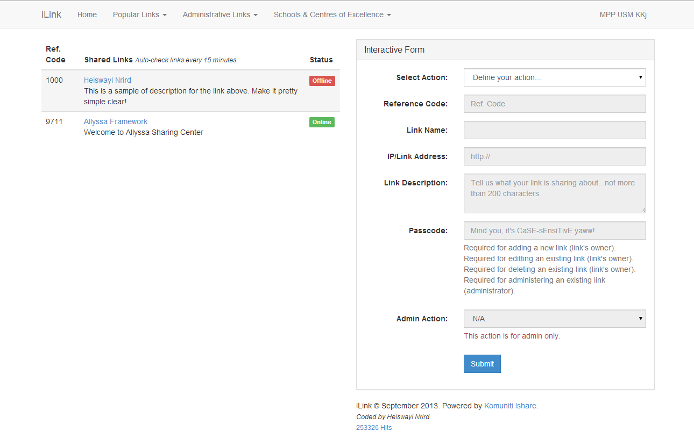

#About iLink

iLink is a simple script written in PHP to monitor [HFS](http://www.rejetto.com/hfs/) servers submitted by sharers (aka students) and accessible to [Komuniti Ishare](https://www.facebook.com/groups/komuniti.ishare/) only.

iLink also is a simplified version of controversial [IsharePortal](https://wayi.me/ishareportal/in-memories/).

Created in September 2013 for Universiti Sains Malaysia Engineering Campus students.

###Screenshot

###Features

* Straightforward functional script for its purpose - HFS servers listing
* Auto-check or monitor online-offline status of each link for every 15 minutes interval
* No user registration required - link submission based on supplied passcode

#License

[MIT License](http://heiswayi.github.io/mit-license)